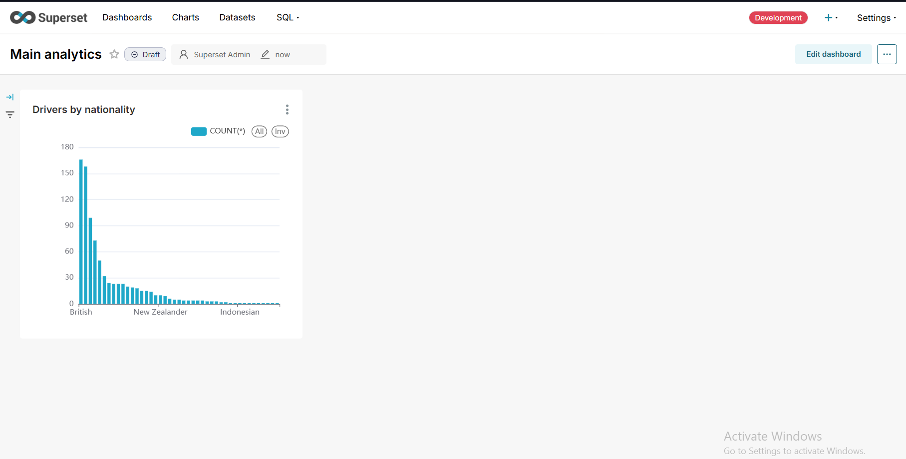

# Velocity-Analytics-Ltd

🏎️ Velocity Analytics Ltd. - Formula 1 Championship Database Project
Company Overview
Velocity Analytics Ltd. is a specialized sports data analytics company focused on motorsport intelligence. We provide comprehensive data analysis services for Formula 1 teams, broadcasters, and racing enthusiasts worldwide. Our expertise lies in extracting meaningful insights from racing data to enhance performance analysis, strategic decision-making, and fan engagement.
Project Description
This project involves the comprehensive analysis of Formula 1 World Championship data spanning from 1950 to 2024. Our database contains detailed information about drivers, constructors, races, qualifying sessions, lap times, pit stops, and championship standings. We perform advanced analytics to uncover trends in driver performance, constructor competitiveness, circuit characteristics, and championship battles throughout F1 history.
Key Analytics Areas:

Driver performance and career trajectory analysis
Constructor championship battles and team evolution
Circuit-specific performance patterns
Qualifying vs. race performance correlation
Reliability and DNF pattern analysis
Home advantage statistical evaluation
Historical championship competitiveness trends

The dataset: https://www.kaggle.com/datasets/rohanrao/formula-1-world-championship-1950-2020

---

## Main Analytics Screenshot


## ER Diagram
Current ERD used for the database schema:


## How to run

Prereqs: PostgreSQL running and loaded with the F1 dataset; Python 3.10+ installed.

1) Configure database environment
- Copy `.env` values (or edit the existing `.env`) with your DB credentials: `DB_HOST`, `DB_NAME`, `DB_USER`, `DB_PASSWORD`, `DB_PORT`.

2) Install Python dependencies
```powershell
py -m pip install -r requirements.txt
```

3) Verify DB connection
```powershell
py connection.py
```

4) Run sample analytics (executes first queries from `queries.sql`)
```powershell
py main.py
```

## Apache Superset (Docker-based)
If you cloned Superset into `C:\Users\tima\superset` and use Docker Compose:

Start (from any folder):
```powershell
docker compose -f "C:\Users\tima\superset\docker-compose-image-tag.yml" up -d
```

Stop:
```powershell
docker compose -f "C:\Users\tima\superset\docker-compose-image-tag.yml" down
```

After Superset is up, connect your Postgres DB using this SQLAlchemy URI format in Superset:
```
postgresql+psycopg2://DB_USER:DB_PASSWORD@DB_HOST:DB_PORT/DB_NAME
```

## Tools and resources
- PostgreSQL, Python 3.10+, Apache Superset (Docker)
- Python libs: `psycopg2-binary`, `python-dotenv`
- Dataset: Formula 1 World Championship (Kaggle)
